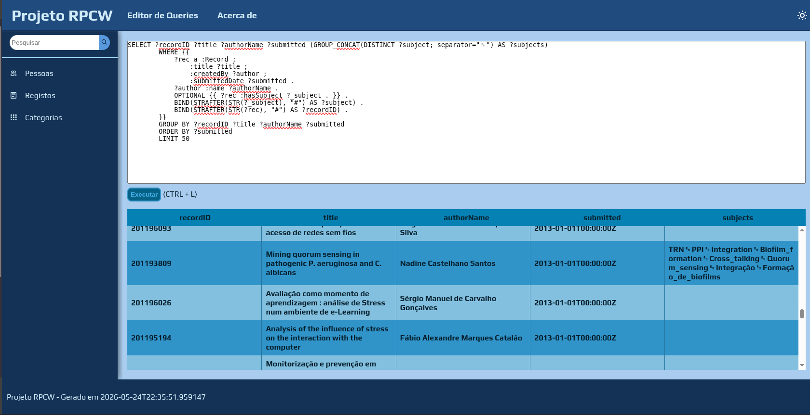
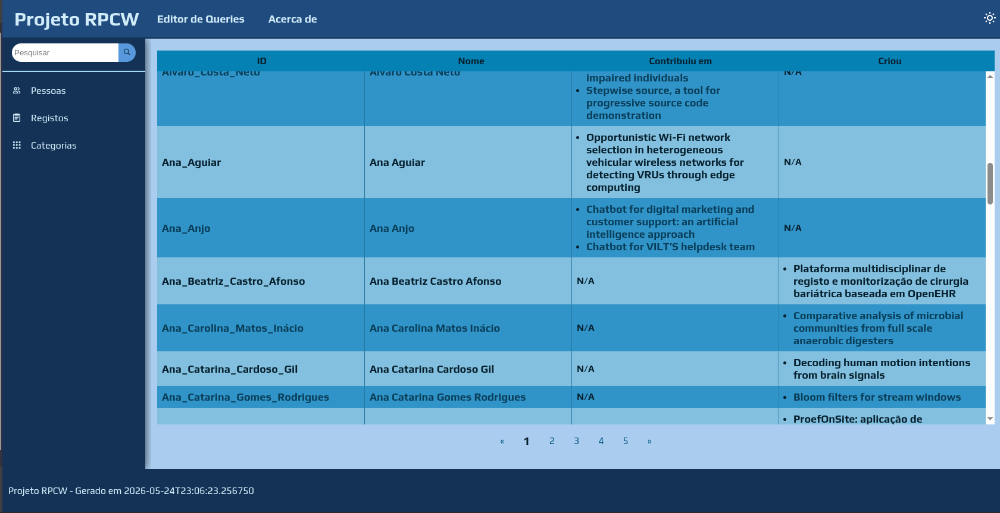
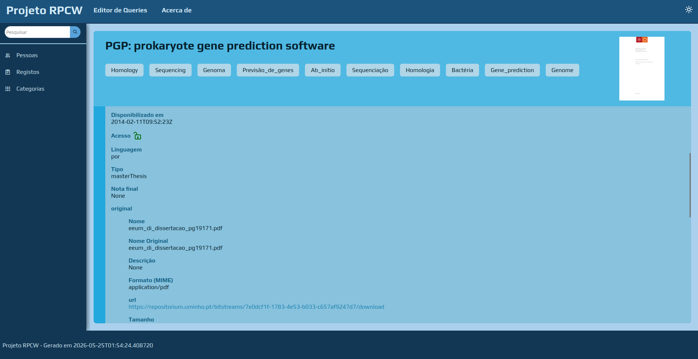

# Projeto RPCW - RepositoriUM
O RepositoriUM é o repositório institucional da Universidade do Minho, que armazena e disponibiliza o acesso a documentos produzidos no ambiente académico.
No âmbito da cadeira de Representação e Processamento de Conhecimento na Web (2026), foi proposto o desafio de criar uma ferramenta de exploração dos dados disponibilizados pelo repositório através do protocolo OAI-PMH (Open Archives Initiative Protocol for Metadata Harvesting), e, para o efeito, foi retirada inspiração da página original encontrada [aqui](https://repositorium.uminho.pt/home).

Para este projeto, apenas nos focámos na exploração dos documentos relativos ao Departamento de Informática.

## Equipa de Desenvolvimento
- Duarte Araújo, pg58806
- Rafael Fernandes, pg60298

## Nota de utilização
É necessário a configuração de um endpoint GraphDB e a importação do ficheiro turtle gerado pelo script de povoamento. 
Informação como o **APP_NAME** da aplicação web, o **GRAPHDB_ENDPOINT** utilizado e o **RDF_PREFIX** para o uso de queries sobre a ontologia deve estar sempre especificada num ficheiro `.env`.

## Extração de dados via OAI-PMH
Para a colheita de metadados é utilizado o script `harvest_xoai.py`, que realiza um pedido de dados ao endpoint especificado, que neste caso corresponde ao provider que desejamos. 
De todos os formatos de metadados disponíveis, o escolhido foi o **xoai**, devido à grande densidade de informação e simplicidade de exploração da estrutura xml em que são enviados comparativamente aos restantes.
Com os dados recolhidos é composto um ficheiro json que contém toda a informação relevante dos registos do departamento.

## Ontologia base
Analisando a informação presente no json, conseguimos elaborar uma ontologia base que sirva para representar todos os objetos identificados e as relações entre eles.
As secções seguintes descrevem a estrutura pensada para a ontologia.

### Classes
- **Person:** Pessoa associada a um registo
  - **Contributor**
  - **Creator**
- **Record:** Registo de um documento
- **Subject:** Temática mencionada em registo
- **Original:** Ficheiro/documento original 
- **Thumbnail:** Imagem de preview de ficheiro

### Data Properties
- **uri:** URI de registo
- **tid:** TID de registo
- **type:** Tipo de registo/documento (ex: masterThesis)
- **title:** Título de registo/documento
- **description:** Descrição de registo/documento
- **submittedDate:** Data de submissão do documento
- **issuedDate:** Idêntica à submittedDate
- **accessionedDate:** Data de criação do registo
- **availableDate:** Idêntica à accessionedDate
- **format:** Formato do ficheiro/imagem
- **language:** Língua do registo/documento
- **grade:** Avaliação atribuída ao documento
- **rights:** Licença de uso do documento
- **rightsURI:** URI da licença de uso do documento
- **name:** Nome de pessoa, ou ficheiro/imagem
- **originalName:** Nome original do ficheiro/imagem

### Object Properties
- **createdBy:** Relação entre um registo e uma pessoa que agiu como autor
- **created:** Inversa da createdBy
- **contributionBy:** Relação entre um registo e uma pessoa que agiu como contribuidora
- **contributedTo:** Inversa da contributionBy
- **hasSubject:** Relação entre um registo e um tema que o descreve 
- **subjectOf:** Inversa da hasSubject
- **hasOriginal:** Relação entre um registo e o ficheiro original
- **isOriginalOf:** Inversa da hasOriginal
- **hasThumbnail:** Relação entre um registo e a imagem miniatura que o representa
- **isThumbnailOf:** Inversa da hasThumbnail

## Povoamento
O povoamento da ontologia é realizado pelo `povoamento_xoai.py`.
Este script lê o json produzido pela colheita e trata da normalização de texto e outros dados que precisem de se enquadrar num certo formato, como datas e IDs.
Além disso, aplica uma guarda para informação que possa estar em falta e cria strings de indivíduos para povoar a ontologia base e gerar um novo ficheiro turtle com todos os triplos referentes às classes definidas anteriormente.

## Aplicação WEB
A aplicação web é um servidor de HTML gerado _on-demand_ através da biblioteca **Flask** e _templates_ **Jinja2**.

### Setup e Execução
Para inicializar a aplicação, deve-se, no diretório [`web`](./web), utilizar o comando `source ./makeenv.sh install` para criar o ambiente virtual necessário para correr a aplicação. Todas as futuras execuções precisam apenas de utilizar o comando `source ./makeenv.sh`.

Para correr a aplicação, deve-se, no mesmo diretório, utilizar o script `run.sh`. Se não forem passados argumentos, o servidor tentará iniciar o servidor na porta `3000`. Utilize `./run.sh --help` para mais informações.

### Estrutura Interna
A aplicação utiliza o **Flask** para receber e processar pedidos HTML, que conectam a um _endpoint_ **SPARQL** (no ambiente de testes, proveniente do GraphDB) por uso da biblioteca **SPARQLWrapper** para executar queries que retornem os dados relevantes ao pedido. Os dados recebidos são então transformados e passados a _templates_ **Jinja2**, que populam dinamicamente os _templates_ antes de serem enviados ao cliente. No lado do cliente, a mínima funcionalidade dinâmica existente é fornecida através de ficheiros **Javascript** estáticos, ou por scripts adicionados dinâmicamente pelo sistema de componentes.

#### Sistema de Componentes
Para uma melhor _DX_ e para simplificar a estrutura dos _templates_, foi criado um sistema de componentes reutilizável pelos _templates_ **Jinja2**. Originalmente, foram tentadas as bibliotecas **JinjaX** e **JX**, mas não foi possível integrá-las de maneira funcional com a infrastrutura já existente, pelo que foram descartadas. Os componentes são registados a partir de um diretório, e, após serem registados, estão disponíveis para uso por todos os _templates_ como se fosse um elemento HTML normal (ex.: `<Componente prop1="val1" prop2="{{ var2 }}"></Componente>`).

### Interface Gráfica
A aplicação web está dividida em 2 secções, o **Editor de Queries** e o **Explorador de Dados**.

#### Editor de Queries
O editor de queries fornece um editor de queries SPARQL que executa queries sobre a ontologia atual na aplicação. O editor transforma os resultados da query numa tabela de valores. Colocando o cursor por cima de cada célula revela o seu tipo, bem como o tipo de dados que ela representa. O editor pode ser acedido a partir de qualquer página.

#### Explorador de Dados
O explorador de dados permite explorar os dados da ontologia com um formato mais fácil de intepretar. O Explorador de Dados permite explorar:
- A lista de registos existentes, visualizando os seus IDs, Títulos, Autores, Temas Abordados e a data na qual o registo foi emitido;
- A lista de pessoas existentes, visualizando os seus IDs, Nomes, Contribuições em Registos, e os seus Registos Criados;
- A lista de categorias abordadas na generalidade.

Além destas páginas agregadoras, para cada indivíduo (Pessoa, Registo e Categoria), é disponibilizada uma página de caráter mais especificico que inclui informação detalhada acerca de um indivíduo em especifico:
- A ficha de um registo, contendo toda a informação que o mesmo regista;
- A ficha de uma pessoa, contendo a informação referente á mesma;
- A lista de todos os registos que abordam uma dada categoria.

As páginas agregadoras são acessíveis a partir da barra de navegação lateral a partir de qualquer página, enquanto as páginas descritivas são acessíveis a partir das anteriores.

_Examplo de uma página agregadora_

_Examplo de uma página descritiva_
